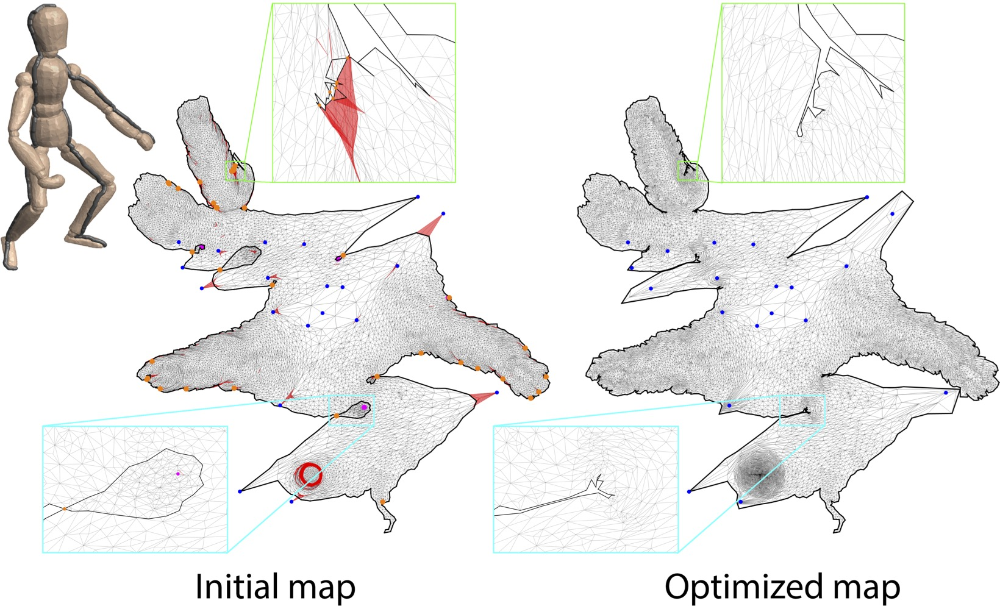
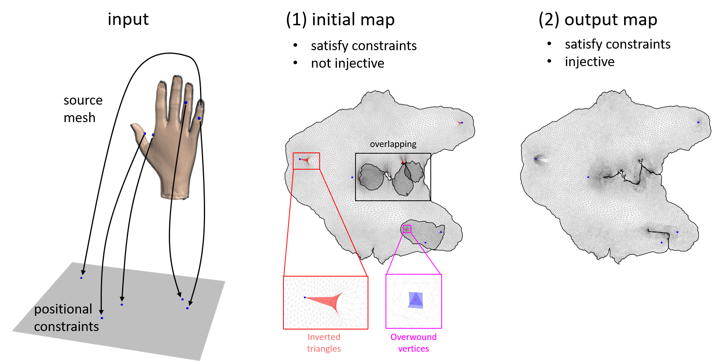

# Optimizing Global Injectivity for Constrained Parameterization

[Xingyi Du](https://duxingyi-charles.github.io/), [Danny M. Kaufman](https://research.adobe.com/person/danny-kaufman/), [Qingnan Zhou](https://research.adobe.com/person/qingnan-zhou/), [Shahar Kovalsky](https://shaharkov.github.io/), [Yajie Yan](https://yajieyan.github.io/), [Noam Aigerman](https://research.adobe.com/person/noam-aigerman/), [Tao Ju](https://www.cse.wustl.edu/~taoju/)
 *ACM Transaction on Graphics (Proceedings of SIGGRAPH Asia 2021)* 

[`Project Page`](https://duxingyi-charles.github.io/publication/optimizing-global-injectivity-for-constrained-parameterization/)
[`Dataset`](https://doi.org/10.5281/zenodo.5547887)

## Abstract

Injective parameterizations of triangulated meshes are critical across applications but remain challenging to compute. Existing algorithms to find injectivity either require initialization from an injective starting state, which is currently only possible without positional constraints, or else can only prevent triangle inversion, which is insufficient to ensure injectivity. Here we present, to our knowledge, the first algorithm for recovering a globally injective parameterization from an arbitrary non-injective initial mesh subject to stationary constraints. These initial meshes can be inverted, wound about interior vertices and/or overlapping. Our algorithm in turn enables globally injective mapping for meshes with arbitrary positional constraints. Our key contribution is a new energy, called smooth excess area (**SEA**), that measures non-injectivity in a map. This energy is well-defined across both injective and non-injective maps and is smooth almost everywhere, making it readily minimizable using standard gradient-based solvers starting from a non-injective initial state. Importantly, we show that maps minimizing SEA are guaranteed to be locally injective and almost globally injective, in the sense that the overlapping area can be made arbitrarily small. Analyzing SEA’s behavior over a new benchmark set designed to test injective mapping, we find that optimizing SEA successfully recovers globally injective maps for 85% of the benchmark and obtains locally injective maps for 90%. In contrast, state-of-the-art methods for removing triangle inversion obtain locally injective maps for less than 6% of the benchmark, and achieve global injectivity (largely by chance as prior methods are not designed to recover it) on less than 4%.

## SEA-QN

Here we release SEA-QN, a program that computes injective mapping under positional constraints by minimize SEA (Smooth Excess Area) energy using quasi-Newton method.

The above figure illustrates **what SEA does**. It takes as input a source mesh, a group of positional constraints and a non-injective initial map, and outputs an injective map satisfying the positional constraints.

This program has been tested on macOS xx.15.5 (Apple Clang xx.0.3) and Windows 10 (visual studio 2019 and 2022).

## Build

### Mac

We use [NLopt](https://nlopt.readthedocs.io/en/latest/) (version 2.6.1)'s L-BFGS quasi-Newton implementation.

The easiest way to build on Mac is to run the script, which installs NLopt using [homebrew](https://brew.sh/) and compiles the program.

    ./build_mac.sh

The program `SEA_QN` will be generated in the `build` subdirectory.

### Windows

To build the program, you can use CMake to generate a visual studio project from CMakeLists.txt.

## How to use

The executable `SEA_QN` asks for 3 arguments: path to an input data file, path to a solver options file, and path to the file to store the result.

    ./SEA_QN [input_file] [solver_options_file] [result_file]

An example is provided in the `example` subdirectory. Test it by:

    ./SEA_QN example/input example/solver_options example/my_result

The result will be written to `example/my_result`.

In the 3 arguments, `input_file` is mandatory, while the rest two are optional. If `solver_options_file` is not specified, `SEA_QN` will look for a file named `solver_options` in the same directory as the binary. If that file is not found, the program will fall back to default options. If `result_file` is not given, results will be written to a file named `result` in the directory of the binary.

## File format

### input_file

_Input file_ contains vertices and faces(i.e. triangles) information about the source mesh and initial embedding, as well as the indices of constrained vertices (called handles or positional constraints). Vertices are indexed from 0.

    [num_sourceVert] [dimension_sourceVert]
    ... (num_sourceVert * dimension_sourceVert) Matrix ...
    [num_initVert]   [dimension_initVert]
    ... (num_initVert * dimension_initVert) Matrix ...
    [num_simplex]    [simplex_size]
    ... (num_simplex * simplex_size) Matrix ...
    [num_handles]
    ... (num_handles * 1) Matrix ...
 
 See `example/input` for a concrete example.
 
 
:tada: **It's possible to use standard mesh formats.** We provide a python script in directory `IO` to convert OBJ mesh formats to our `input_file` format.
 
 To use the script, make sure to install [meshio](https://github.com/nschloe/meshio) with
 
     pip install meshio
 
 To convert triangle meshes to our input format, run
 
    ./convert_input_2D.py [inputObjFile] [handleFile] [outFile]
 
 Currently, we only support OBJ file with initial mesh as uv coordinates. Check out our [dataset](https://doi.org/10.5281/zenodo.5547887) for some concrete OBJ and handle files. The `handleFile` contains a list of indices of constrainded vertices (indexed from 0).
 The generated `outFile` will have the format of our `input_file`.

 
### solver_options_file

_Solver options file_ contains parameters for SEA energy, options for NLopt solver, and a list of intermediate status to record during optimization.

    form
    [harmonic OR Tutte]
    alphaRatio
    [val]
    alpha
    [val]
    theta
    [val]
    ftol_abs
    [val]
    ftol_rel
    [val]
    xtol_abs
    [val]
    xtol_rel
    [val]
    algorithm
    [LBFGS]
    maxeval
    [val]
    stopCode
    [none OR no_flip_degenerate OR locally_injective OR globally_injective]
    record
    vert    [0 OR 1]
    energy  [0 OR 1]
    minArea [0 OR 1]
    nbWindVert [0 OR 1]
    grad [0 OR 1]
    gradNorm [0 OR 1]

The following table explains each option in details.
We **recommend** using the default values (especially "form", "alphaRatio", "alpha" and "theta") as they lead to high success rate in our experiments. 
 
See `example\solver_options` for a concrete example.

|                | possible values  | default value | explanation                                                                                                                    |
|----------------|------------------|---------------|--------------------------------------------------------------------------------------------------------------------------------|
| form           | harmonic, Tutte  | Tutte         | two forms of SEA energy (see paper for details)                                                                                |
| alphaRatio     | [0, inf)         | 1e-4          | Specify the ratio of content (area or volume) between rest mesh and target domain. Default value 1e-4 is recommended.          |
| alpha          | (-inf, inf)      | -1            | If negative, alpha will be computed from alphaRatio. If non-negative, alpha will overwrite the value computed from alphaRatio. |
| theta          | [0, 2Pi)         | 0.1           | Specify the center angle of circular arcs replacing straight edges of the mesh boundary. (see paper for details)               |
| ftol_abs       | (-inf, inf)      | 1e-9          | Absolute energy change stop threshold. Negative value means disabled.                                                          |
| ftol_rel       | (-inf, inf)      | 1e-9          | Relative energy change stop threshold. Negative value means disabled.                                                          |
| xtol_abs       | (-inf, inf)      | 1e-9          | Absolute variable change stop threshold. Negative value means disabled.                                                        |
| xtol_rel       | (-inf, inf)      | 1e-9          | Relative variable change stop threshold. Negative value means disabled.                                                        |
| algorithm      | LBFGS            | LBFGS         | Quasi-Newton method.                                                                                                           |
| maxeval        | positive integer | 10000         | max number of iterations stop threshold.                                                                                       |
| stopCode       | none, no_flip_degenerate, locally_injective, globally_injective   | globally_injective      | Custom stop criteria. "globally_injective": optimization will stop when the map becomes globally injective.                                   |
| record:vert    | 0, 1             | 0             | 1: record target mesh vertices at each iteration.                                                                              |
| record:energy  | 0, 1             | 0             | 1: record SEA energy at each iteration.                                                                                        |
| record:minArea | 0, 1             | 0             | 1: record smallest simplex signed content (area or volume) at each iteration.                                                  |
| record:nbWindVert | 0, 1          | 0             | 1: record number of overwound vertices at each iteration.                                                                      |
| record:grad       | 0, 1          | 0             | 1: record gradient at each iteration.                                                                                          |
| record:gradNorm   | 0, 1          | 0             | 1: record the norm of gradient at each iteration.                                                                              |
      
   

### result_file

_Result file_ stores the vertices of result mesh, and also intermediate records as specified in solver options file.

    
    name dims
    data
    ...

See `example\result` for a concrete example.

We provide a script to convert a `result_file` to a mesh file in directory `IO`.

Usage

    ./get_result_mesh.py [inputFile] [resultFile] [outFile]

For example, 

    ./get_result_mesh.py example/input example/result result.obj

## Dataset

**Download**:

We release the benchmark dataset used to evaluate our method and compare with existing methods. The dataset includes _1791_ triangular mesh examples. Each example includes a source mesh, up to 20 positional constraints, and a non-injective initial mesh generated by ARAP method. The dataset comes with both inputs and results of our method.
